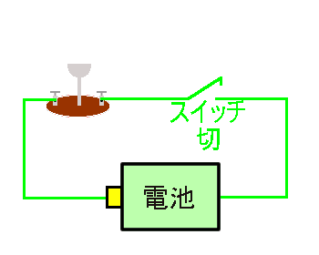

# 電気の基礎知識 Aコース　[top](./../index.md)　map　map1

　電気（でんき　electricity） とは電荷（でんか　electric charge）を持った物質（ぶっしつmatter）である電子(でんし　electron)や陽子（ようし proton）やイオン(ion)のさまざまな働きのことです。
　 冬になると衣服がこすれて身体にまとわりついたり、ひどいときには火花が発生したりする現象や鉄片などを引き付ける現象は古くから身近にあった電気現象です。 これらは電荷がほとんど移動しない電気のことを静電気といいます。
一般に電気製品等で使う電気は電荷の流れです。そのことを「電気が流れる」といいますが、この現象についてのイラストが「電気の流れ」にあります。
　電子はマイナスの電荷、陽子はプラスの電荷を持っています。電圧（でんあつ）は電荷の集中の度合いを表し、電流（でんりゅう）は電荷の流れを表しています。
　 電荷が動くと磁気を発生します。また磁気の変化は電荷を移動させる働き（電磁誘導）があり、電荷と磁気が相互に作用しあって電波など（電磁波）を発生させます。

## 電気の利用

　電気が実用になったのは、1800年にボルタによって電池が発明され、それを利用して1831年に5針式電信機が発明され、1838年にはモールス符号で言葉を送る電信の実証試験に成功し、本格的な電気通信が実用化され、ベルによって電話が発明され、計算機の発明によって今日のインターネットの発展につながっています。
　一般の家庭で電気が利用されるようになったのは、エジソンが1882年にニューヨーク市に発電所を建設しエジソン電灯会社が一般家庭の電灯用に本格的に電気の供給を開始してからです。 1834年にダベンポートによって電動機が発明され、電気洗濯機や掃除機等に応用され、家庭用(家電機器の歴史)にも使用されるようになり、電気を動力として利用するようになりました。

### 関連事項

* 電気の根本的な性質とは何か
* 電荷とは
* 電界
* 電圧
* 電流
* 電気の流れ
* 抵抗
* 抵抗標準
* 電気回路
* 交流直流
* クーロンのねじりはかり（電荷による電気力の測定）
* ガルバーニの蛙の脚の実験
* ボルタ電堆
