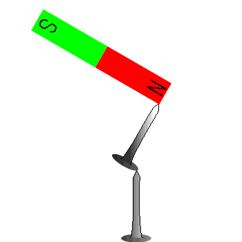

# 磁気の基礎知識　Aコース　[top](./../index.md)　map 　map1　

磁石（じしゃく　magnet）の引き付けたり、反発する性質を磁気といいます。磁気が周囲の磁石や電流に力を及ぼす空間を磁界（じかいmagnetic field）といい、磁界の強さは電流によって作られる磁界の強さ（H　アンペールの法則）や磁束（じそく　magnetic flux ）で表されます。
　磁石に他の磁石を近づけると，互いに引き付けますが、その反対側を近づけると反発したりします。このように磁石の両端は異なる性質を持っていて、磁石の両端を磁極（じきょく magnetic poles)といい、その磁極が及ぼす力を磁力（じりょく　Magnetic forces）といいます。

磁気の作用

## 電流の磁気作用(エルステッドの実験)

　1820年にエルステッドは電気（電流）にもコンパス（方位磁石）の針を動かすなどの磁気作用があることを発見しています。
(詳細はエルステッドの実験参照してください)

磁力の根本になる電子のスピン
磁石は何もしなくても半永久的に磁力を出し続けますが、これは非常におかしな現象です。これを理解するには量子力学の知識が必要ですが、結論的にいえば、磁石の磁力は磁石内部の電子が持っている電子のスピンに関係があり、電子が持つ固有の性質です。

### 関連事項

* 磁力・磁気力・磁力線とは
* 磁荷というものは存在しないのです！
* 磁場・磁界（物理系では磁場という）
* 磁力の根本になる電子スピン
* 磁極とは
* 永久磁石
* 地球の磁場
* 電磁誘導
* モノポール問題
* エルステッドの実験
 
