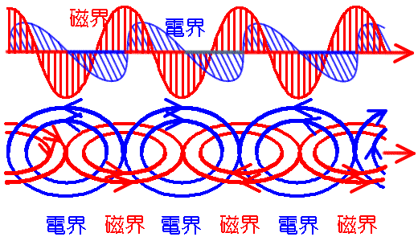

# 電磁波の基礎知識　Aコース　 [top](./../index.md)　map map1

電磁波(でんじは electromagnetic waves)の基礎知識

電子の持っている電荷は電界を作ります、これが移動する（電流が流れる）とその周りに磁界を発生させます。

電荷が一定方向に移動するのが、直流で、電荷が行き来するのが 交流ですが、交流では電流が変化すると磁界も変化し、 この磁界の変化は変化する電界を発生させ、電界の変化は変化する磁界を発生させます。

このように連続した変化が有限な速度（光速）で伝わるのが電磁波です。

電磁波は真空中を光速で伝わる波で、電波や光も電磁波です。

1864年にジェームズ・クラーク・マクスウェルが、電磁波の存在を理論的に予言し、 それを1888年にハインリヒ・ヘルツが実験的に発見しました。1897年にマルコニー（Guglielmo Marconi）ウェイトのアイスルから20マイル離れたプールまで無線通信に成功した。（詳細は電気通信の歴史を参照して下さい）

電磁波は、電磁放射（でんじほうしゃ　electromagnetic radiation）ともいいます。

### 関連事項 　

* 周波数・波長・周期・振幅とは
* 電磁波の伝播と光速
* 電磁波の種類
* 電波の定義
* 電波の種類
* 赤外線
* 遠赤外線
* 近赤外線
* 可視光線
* 紫外線
* X線
* ガンマ線
* 無線通信
* 送信機
* 受信機
* ヘルツの電磁波の確認実験

