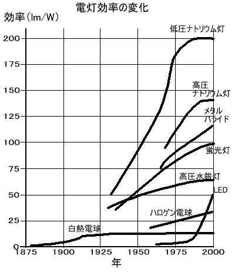

# 電灯照明の原理と歴史　[top](../index.md)　　電灯の歴史年表　電球の歴史　電球の原理　放電　放電灯の歴史　水銀灯の歴史　光に関する用語

概要  
　1799年にボルタによって電池が発明されて、安定した電気を使用できるようになると、翌年の1800年にはフランス人セナードによって細い線に電流を流し、光を出す実験がおこなわれていて、1802年にはスイスの科学者、ハンフリー・デービはアーク灯の公開実験に成功し、さらに細い線に大量の電気を流すとその線が白熱して光を出すことも実験しました。 これが、電気による光の始まりで、放電と白熱光です。  
　1857年には セリン（Serrin）のアーク灯は実用的なランプを作るのに成功し、1876年ロシアのポール・ジャブロコフは“エレクトリック・キャンドル”を発明し 1878年10月14日にはこのアーク灯を使用してサッカーのナイトゲームが行われました。しかし、電灯はガス等に比べ、電池を使用していたことから非常に高価なものでしたので、実用化にはいたりませんでした。  
　 電灯が実用化するには発電機の開発が必要でした。1869年グラム（Zenobe Theopile Gramme）はダイナモ方式による実用的なグラム発電機(Gramme dynamo)を発明し電気による照明が実用化に向けて急速な進歩をしました。  
　一方、白熱電球には、高温にしたフィラメントが短時間で燃え尽きてしまうという大問題がありことでした。その解決策としては高温に耐えるフィラメント材料の選定とフィラメントの均一性の確保、酸素との接触を排除する必要がありました。  
電球が実用化に近づいたのは185４年米国に移住したドイツ人のハインリッチ・ゴーベルは、竹ひごを炭化したフィラメントで電球を作り、自分の　商品をライトアップして注目を集めましたが、商品化には至らず中断されました。  
1878年にイギリスのスワン（Joseph W Swan） は、そのころ発明された性能の良い水銀真空ポンプを電球作りに利用し、真空度を上げた真空炭素（細長い炭素の繊条）電球を作りました。  
1879年11月10日エジソンは英国に炭素フィラメントで排気したガラス球で作った白熱電球の特許を申請しました。  
1880年にはエジソンランプ会社が設立され、電球の販売とそれに必要な電気の販売のために発電所の建設を始め、電球が実用化され電灯会社の事業が展開されるようになりました。  
1890年代の初めに米国のピータ・クーパ・ヘイウィト（Peter Cooper Hewitt）は水銀で満たされたガラス管での実験を開始し、青緑がかった光が出ることを発見し、これで水銀ランプを作りました。これが放電灯の始まりです。アーク灯が大気中の放電でしたが、ガラス管の中に特定のガスを封入した放電管による電灯でした。  
1927年水銀灯の光には紫外線を多量に含んでいて、水銀灯の内面に蛍光物質を塗布して、そこに紫外線を当て、可視光線に変換する蛍光灯の特許を取得し、非常に効率的な光源を作ることができるようになりました。  
1962年ニック（Nick Holonyak Jr）によって半導体による発光ダイオードが発明され最近照明に使用されるようになってきました。  
その間、電灯は電灯の種類の増加や光の発生効率すばらしい発展を遂げてきました。   

### 関連事項　

* 光源の種類　
* 白熱電球の構造　
* 光源の発光効率　
* 電球の発明者をめぐる法廷闘争　
* 暗放電　
* グロー放電　
* アーク放電　
* 放電灯　
* 放電灯の種類　
* 蛍光灯　
* 励起状態 　
* プラズマ状態　
* 発光スペクトル 　
* 色　
* 色温度　
* 視感度　
* 演色性　
* 白金フィラメントの発明者　
* デンデラの電球とバグダッドバッテリー  
