# 発電機と電動機の歴史の概要説明　[top](../index.md)　 発電機と電動機の原理　　発電機と電動機の歴史年表

初めに  
1799年ボルタは異なる金属と金属の間に発生する電気を発見してボルタの電池を作りました。  
この電池を使って、1820年にはエルステッドは電流を流した針金の近くに置いてあった方位磁石が電流に反応すること（電流の磁気作用）を発見しました。  
1831 年にファラディはコイルの中で磁石を動かすと、コイルの中の磁気が変化することによって電流が流れるという電磁誘導の法則を発見し、この法則が機械力と電気力の相互変換を可能にする法則で、電気エネルギーの利用に必須となる機器（発電機、電動機や変圧器等）の出現を予測するものでした。  
この法則は直ちに実用化に向けて開発が開始されました。そして、発電機ができると電球が作られ、電灯事業が開始されます。  
ここでは、実用的な発電機と電動機が作られるまでの先人たちの苦闘の歴史を少し詳細に見ていきます。  

（拡大図があります。リンクまたは図をクリックしてください）  
1821年にマイケル・ファラディ（Michael Faraday）はファラディのモータ（Faraday motors）と呼ばれる最初の電動機（electric motors）を発明しました。  

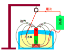

　これを公開実験で多くの人々に見せたのですが、電気エネルギーを機械力として利用するこの実験の重要性を誰一人として認識することはできませんでした。 電気なしでは生きていけない現在の世界を実現する第一歩となる歴史的な瞬間に立ち会えたのに。一般にはまだ電気の重要性は認識されていませんでした。しかし、電気の不思議な性質に取り付かれた人たちがいました。これからその一部を見ていきます。  

1822年ピータ・バロー（Peter Barlow）はバローの車輪（Barlow wheel）を発明しました。

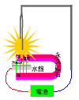

車輪の歯車の先端が水銀に接触すると歯車に電流が流れ、その電流と永久磁石の磁気との作用（フレミングの左手の法則に従う）で歯車には回転する力が与えられます。  

1824年アラゴはアラゴの円盤（Arago's Disk）を発見しました。  

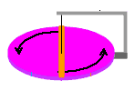

　磁気を帯びていない金属板（例えば銅版）の上に少し隙間を置いて磁針を吊るしておき、下の金属板を回転させると磁針に金属板が接触しないにもかかわらず、磁針が振動する現象を発見しました。  
　これは、磁針がもっている磁気と円盤の運動によって電磁誘導現象が生じて、電流が流れ、その電流による磁気が生じて磁針を振動させたと考えられます。  

1825年ウイリアム・スタージョン（William Sturgeon）は電磁石（Electromagnet）を発明しました。  

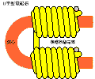

電磁石は電流によって磁気を生じさせる装置で、馬蹄形の鉄にコイルを巻いたものでした。コイルに電流を流すと磁気を帯、電流を切ると磁気がなくなりました。  

1830年ジョセフ・ヘンリJoseph Henryは電磁石を改良して電信や鉄鉱石の選別に応用しました。  

1831 マイケル・ファラディ（Michael Faraday）はコイルの中で磁石を動かし、コイルの中の磁気が変化することによって電流が流れるという電磁誘導（electromagnetic induction）の法則を発見しました。  
この法則は機械力と電気力の相互変換を可能にする法則の発見で、電気エネルギーの利用に必須となる機器（発電機、電動機や変圧器等）の出現を予測するものでした。  

1832年 マイケル・ファラディ（Michael Faraday）はファラディの円盤（Faraday disc）を発明しました。  

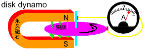

　これは馬蹄形の永久磁石の磁界（緑の矢印）中で電気を通す円盤（銅版）を回転させると円盤の外側から内側に向かって電流が流れるものでした。この原理は少し複雑ですので省略しますが、結果的には円盤の内側と外側で速度に差がある（「磁束を切る」量が外側の方が多い）ことから外側から内側に向かって電流が流れることになります。  

1832 年ピクシイ（Hippolyte Pixii）はファラディの電磁誘導の原理を使った最初の発電機（Pixii dynamo ピクシイダイナモ）を発明しました。  

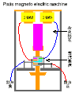

　これは永久磁石を回転させて磁石のN極またはS極がコイルの下を通過するときに、コイルの中を通る磁束が変化することから、ファラディの電磁誘導の原理に従ってコイルに電気が発生します。この発生した電気は磁石のN極かS極のいずれが通過するかによって、発生する電気の方向が反対になることから、回転軸に取り付けた整流子によって電気の流れを一定の方向に揃えて「波打った電気」を作ることに成功しました。  
　これが今日使用されている発電機や電動機の原型になりました。  
　コイルの内部を通る磁束の変化のことをコイルが「磁束を切る（鎖交磁束）」ということもあります。  
一般的にはコイルの内部を通る磁束の変化は、外部から機械力を与えることによって作り、コイルと磁束とが相互作用（電磁誘導）することによって電気が作られます。  
従って、発電機の構造はいずれか一方を固定し（固定子）、他を外部からの機械力によって回転（回転子）させることで実現されますので、コイルを回転させるものと、磁石（磁束）を回転させるものとの二通りがあります。  

1834年トーマス・ダヴェンポート（Thomas Davenport）は最初の実用的な直流電動機(DC electrical motor)の特許を取得しました。  

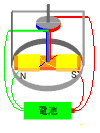

これまでの電動機は単に回転子が回転する原理を示すがけのものでしたが、この電動機は電気の力を機械の力に変換する、力強い回転力が出せるもので、後にボルタの電池を積んで約直径1.2mのレール上を走行する電気機関車の実験に成功しています。  

1836年クラーク（E. M. Clarke）はクラーク発電機（Clarke Magnetic Electrical Machine）を発明しました。  

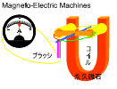

1837年8月ページ(Charles Grafton Page)は電動機として回転する磁石（Revolving Magnet）を発明しました。後1842年から発電機としても使用するようになりました。  

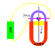

1838年2月ページの医療用発電機（Revolving Armature Engine）を発明しました。  

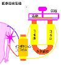

　これは、永久磁石にコイルを巻き、磁極間に鉄の棒を吸着させておき、手動で鉄棒を回転させると電気が発生するものです。  
　鉄棒が磁石に吸い付けられているときには磁束が多く、鉄棒が磁石から離れると磁束は少なくなります。これは、空気よりも鉄のほうが磁気を通す能力が大きいためです。  

1838年ページは誘導コイル（インダクションコイルinduction coil）を発明しました。  

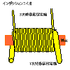

　電磁石（1次側）の上に別のコイルを巻く（2次側）と2次側の巻き数が1次側より多くなると電磁石の電気を流したり切ったりする瞬間に一次側の電圧よりも高い電圧（巻き数の比に比例する）が発生するもので、ページの医療用発電機と組み合わせて高い電圧を人体に通して麻痺、リュウマチ、捻挫、凍傷、やけど等の治療（その多くはプラシーボ効果によるものか）に用いられました。これが変圧器の原型ですが、当時はまだ交流電気の利用方法が確立されていませんでした。  
　｛理論的な説明　　　　電源に接続されたコイルに電流を流すとコイルの流れる電流の磁気作用によって磁気（磁束）が発生します。この磁気の発生によって、2次側のコイルには電磁誘導の法則にしたがって電気（磁気を打ち消そうとする方向に電流を流すように起電力）が生じます。その大きさは電流の変化の大きさ（電流の微分値）とコイルの巻き数比の積に関係（比例）します。）  

1839年にページ（Charles Grafton Page）の設計でダニエル・デービス（Daniel Davis）が往復動の電動機を製作しました。二組の電磁石を交互に動作させて、電磁石の吸引力による上下の運動をクランク車輪で回転力に変える方式でした。  

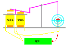

　この方式は電気エネルギーを機械エネルギーに変換するには邪道のように思われますが、現在でも意外に多く使用されていて、身近なところでは電気時計の針を動かすモータにこの原理を使用したものが多く使用されています。オン･オフと二つの状態を取るこの方式は、デジタル方式と相性が良く、構造も単純なことから、これからもっと多く使用されるようになると思われます。  
　　
1842年ページは1837年に発明した回転する磁石をページの発電機（Magneto-Electric Machines）としても使用するようになりました。  
　原理的には発電機と電動機は構造が同じで、入力と出力が異なるだけです。  

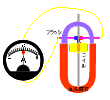

1844年フロメント（Paul-Gustav Froment）はフロメント電動機（Froment motor）を発明しました。  

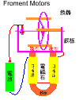

回転するリングに鉄棒を横に付け、鉄棒が近づくと電磁石に電気を流し鉄棒を引き付け、鉄棒が電磁石の上に来たときに、電流を切ってリングが慣性力で回転し、次の鉄棒が近づいたときにまた電磁石に電気を流す動作を繰返します。  
電流の切り替えをする装置のことを整流器といい電気を流す導体を回転軸に取付け、ブラシで両側から挟み回転角度に従って電流を流すタイミングを決定します。  

1866年シーメンス（Werner von Siemens）はダイナモ方式（dynamo-electric principle）を発表しました。  
これは、永久磁石の替わりに強力な電磁石を使用した発電機が作られるようになりましたが、そのためには、で電磁石に電気を供給するためのバッテリーが必要でしたが、このバッテリーをなくして、電磁石に残っている僅かな磁気を利用して発電し、その電気を電磁石に供給するダイナモ方式の発電機を発表し、実用的な発電機のモデルを創りました。  

1869年グラム（Zenobe Theopile Gramme）はダイナモ方式による実用的なグラム発電機(Gramme dynamo)を発明しました。  

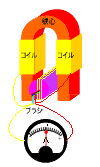

1871年グラムは発生電圧を高く（約200ボルト）した実用モデルをつくり、更に改良が重ねられアークランプ点灯の事業に使用されました。  
　それまではヴォルタの電池を数百セル接続してアークランプを点灯させていましたが、実用的な発電機ができ電灯に関する技術が急速に実用化されていきます。  

1873年グラムはヒッポリィ・フォンテイン（Hippolyte Fontaine）との協力によって作ったグラム発電機をウイン展覧会に実演展示し、2台の発電機を蒸気機関で駆動して発電していましたが、電線の接続を間違えて停止中の発電機に電気を流してしまい、停止中の発電機が逆転する事故が発生しました。  
これが発電機で電動機を駆動できることを実験した最初のできごとだとされています。  
　原理的には、この種の発電機は機械力を電気に変換しますが、逆に電気を機械力に変換することもできます。従って発電機に外部から電気を供給すると軸が回転し、電気を機械力に変換する電動機（electric motorsモータ）になります。  

交流発電機（Alternator）  

1881年にシーメンス（Siemens ）は水車で駆動する交流発電機（Alternator）で英国のゴッダルミング（Godalming, United Kingdom）の街灯を点灯しました。これが交流で電灯を点灯した最初です。  
1882年には英国のゴードン（J.E.H.Gordon）は2相交流発電機を作りました。これが、最初の多相交流の利用です。  
1886年3月20日にスタンレイ（William Stanley）によって交流発電機の最初の公開実験が行われました。  
1891年にはテスラが実用的な高周波発電機（約15000Hｚ）を作りました。  

交流電動機（AC motor）  

1882年に英国のゴードンは2相交流発電機を作りました。  
1882年にテスラによって回転する磁界の原理が考案され、1883年に2相電動機の設計がされました。  
1883年に多相交流による誘導電動機の原理を思いつき、  
1884年にはWH社で10馬力（7.5kW）の誘導電動機が作られ、以降急速に電動機のスケールアップがなされるようになります。  
1888年に400w（1/2馬力）の2相電動機を作りました。  
1890年にミチェル・ドブロウスキー（Michael von Dolivo-Dobrowlsky）によって３相かご型誘導電動機が発明されました。  
1910年代の初めに直流でも単相交流でも運転できる小型電動機（ユニバーサルモータ）が発明されます。家庭用の電灯線からの電気を使って働く単相交流電動機が実用化され、ミシンや掃除機や洗濯機等の動力源として使用されるようになります。  

